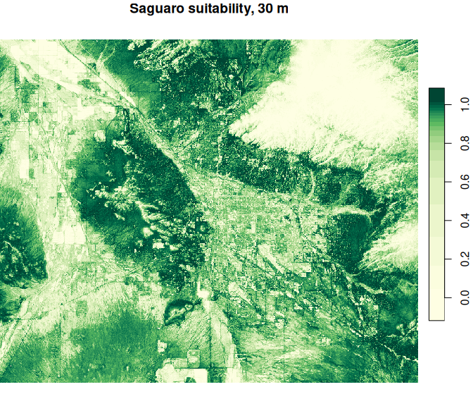

# AlphaSDM

[](https://lifecycle.r-lib.org/articles/stages.html#experimental)
[](https://github.com/James-Longo/AlphaSDM/blob/main/LICENSE.md)

AlphaSDM fits species distribution models and maps habitat suitability at up
to 10 m resolution, anywhere on Earth, from occurrence records alone. It
models species on the embeddings of AlphaEarth, Google DeepMind's geospatial
foundation model, instead of environmental layers you collect yourself, and
runs every step on Google Earth Engine.

<p>
  
  
</p>

*Saguaro around Tucson, Arizona: GBIF records and pseudo-absences (left), and
the fitted habitat-suitability map at 30 m (right). The full example is in
`vignette("AlphaSDM")`.*

## Why AlphaSDM

- **No environmental layers.** There is nothing to find, download, reproject
  or align; the embeddings already describe every pixel.
- **Fine resolution everywhere.** 10 m pixels, every year from 2017, on land
  anywhere on Earth.
- **Nothing to download but the map.** Sampling, model fitting and prediction
  all run on Earth Engine, so a large study area costs your computer nothing.
- **An ensemble with calibration built in.** Support vector machine, random
  forest and boosted trees by default, scored with AUC, TSS and the Boyce
  index.
- **Explicit modelling choices.** Pseudo-absence placement follows
  Barbet-Massin et al. (2012), and AlphaSDM makes you choose the strategy
  rather than choosing it for you.

## AlphaEarth embeddings

[AlphaEarth Foundations](https://arxiv.org/abs/2507.22291) is a Google
DeepMind model that condenses optical, radar, lidar, climate and other data
into 64 numbers per 10 m pixel per year. The annual embeddings are a public
[Earth Engine dataset](https://developers.google.com/earth-engine/datasets/catalog/GOOGLE_SATELLITE_EMBEDDING_V1_ANNUAL),
currently covering 2017 to 2025. Records are matched to the embeddings for the
year they were made.

## Installation

```r
# install.packages("pak")
pak::pak("James-Longo/AlphaSDM")
```

## Earth Engine setup

AlphaSDM runs on your own Earth Engine account, which is free for
noncommercial use.

1. [Register for Earth Engine](https://earthengine.google.com/signup/). This
   gives you a Cloud project ID.
2. Connect once per machine. A browser window asks you to allow access, and
   the connection is remembered after that.

```r
library(AlphaSDM)
setup_gee(project = "your-project-id")
gee_status()   # checks credentials, project and a live connection
```

On a machine without a browser, use `setup_gee(auth_mode = "notebook")` to
paste a code instead. `clear_gee_credentials()` resets everything.

## Example

Download saguaro records from GBIF, fit the default ensemble on 2022 records,
test it on 2023 records, and map suitability:

```r
library(AlphaSDM)

gbif_records <- function(year) {
  url <- paste0("https://api.gbif.org/v1/occurrence/search?",
                "scientificName=Carnegiea%20gigantea&year=", year,
                "&hasCoordinate=true&hasGeospatialIssue=false",
                "&coordinateUncertaintyInMeters=0,30",
                "&decimalLongitude=-111.4,-110.6&decimalLatitude=31.9,32.6&limit=300")
  do.call(rbind, lapply(c(0, 300), function(offset)
    jsonlite::fromJSON(paste0(url, "&offset=", offset))$results[
      , c("decimalLongitude", "decimalLatitude", "year")]))
}
coords <- c("decimalLongitude", "decimalLatitude")

# Fit on 2022 records with pseudo-absences
pres <- format_data(gbif_records(2022), coords = coords, year = "year")
occ  <- generate_pseudo_absences(pres, aoi = "bbox", strategy = "combined",
                                 n = nrow(pres))

# Test on 2023 records against random background
pres_2023 <- format_data(gbif_records(2023), coords = coords, year = "year")
test <- generate_pseudo_absences(pres_2023, aoi = "bbox", strategy = "random",
                                 n = 2000)
fit  <- evaluate_models(occ, predict_coords = test)
fit$metrics$ensemble

maps <- generate_map(occ, aoi = "bbox", scale = 30, aoi_year = 2022,
                     output_dir = "saguaro")
```

`generate_map()` writes one GeoTIFF per model plus the ensemble. Maps download
straight from Earth Engine in tiles; a map Earth Engine will not compute that
way goes through its batch system and Google Drive instead, which is slower.

## Models

The default ensemble is `c("svm", "rf", "gbt")`. `methods =` also accepts
`"maxent"`, `"glm"`, `"cart"`, `"knn"`, `"mindist"` and `"similarity"`, all
fitted on Earth Engine; see `?evaluate_models`.

## Getting help

Report bugs and request features in
[GitHub issues](https://github.com/James-Longo/AlphaSDM/issues), or email
[james.longo.birds@gmail.com](mailto:james.longo.birds@gmail.com). AlphaSDM is in active
development, so arguments and defaults may still change.

## Citation

Run `citation("AlphaSDM")` in R, or use GitHub's "Cite this repository"
button, which reads [`CITATION.cff`](https://github.com/James-Longo/AlphaSDM/blob/main/CITATION.cff).

## License

MIT; see [LICENSE.md](https://github.com/James-Longo/AlphaSDM/blob/main/LICENSE.md). The AlphaEarth embeddings are provided by
Google under the terms of the
[Earth Engine dataset](https://developers.google.com/earth-engine/datasets/catalog/GOOGLE_SATELLITE_EMBEDDING_V1_ANNUAL).
