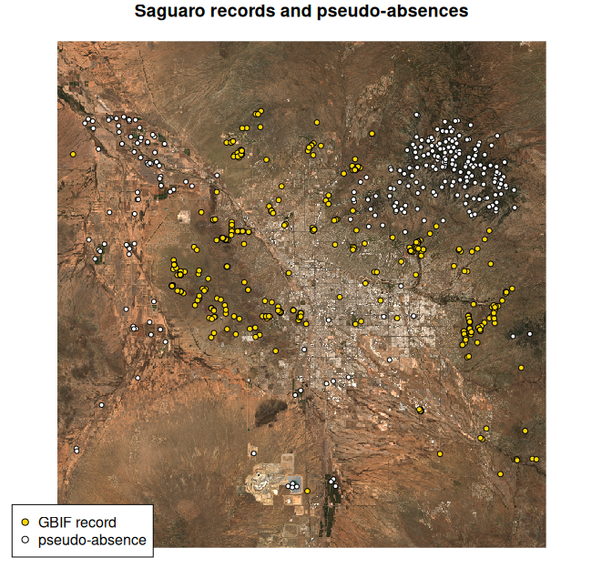

# Getting started with AlphaSDM

AlphaSDM fits species distribution models on Google’s AlphaEarth
satellite embeddings: 64 numbers per 10 m pixel that summarise what the
land surface looks like there, for every year since 2017. Sampling,
model fitting and mapping all run on Google Earth Engine, so there are
no environmental layers to find, download or align.

This vignette maps saguaro cactus (*Carnegiea gigantea*) around Tucson,
Arizona, from public GBIF records to a habitat-suitability map, and uses
each step of the workflow once.

**Before you start**, connect to Earth Engine once per machine with
`setup_gee(project = "your-cloud-project")`; the README explains the
free registration. After that, AlphaSDM connects on its own.

## Get occurrence records

The GBIF occurrence API is public and needs no account. This query asks
for 2022 records inside a box around Tucson, keeping only those with
coordinates accurate to 30 m, which suits 10 m embeddings. The API
returns at most 300 records per request, so it takes two pages.

\
`url`` ``<-`` `[`paste0`](https://rdrr.io/r/base/paste.html)`(`\
`  ``"https://api.gbif.org/v1/occurrence/search?"``,`\
`  ``"scientificName=Carnegiea%20gigantea&year=2022"``,`\
`  ``"&hasCoordinate=true&hasGeospatialIssue=false"``,`\
`  ``"&coordinateUncertaintyInMeters=0,30"``,`\
`  ``"&decimalLongitude=-111.4,-110.6&decimalLatitude=31.9,32.6&limit=300"``)`\
`obs`` ``<-`` `[`do.call`](https://rdrr.io/r/base/do.call.html)`(``rbind``, `[`lapply`](https://rdrr.io/r/base/lapply.html)`(`[`c`](https://rdrr.io/r/base/c.html)`(``0``, ``300``)``, ``function``(``offset``)`\
`  ``jsonlite``::`[`fromJSON`](https://jeroen.r-universe.dev/jsonlite/reference/fromJSON.html)`(`[`paste0`](https://rdrr.io/r/base/paste.html)`(``url``, ``"&offset="``, ``offset``)``)``$``results``[`\
`    , `[`c`](https://rdrr.io/r/base/c.html)`(``"decimalLongitude"``, ``"decimalLatitude"``, ``"year"``)``]``)``)`\
[`nrow`](https://rdrr.io/r/base/nrow.html)`(``obs``)`\
`#> [1] 438`

## Format the records

[`format_data()`](https://james-longo.github.io/AlphaSDM/reference/format_data.md)
standardises column names, checks that coordinates are WGS84 longitude
and latitude, and drops records outside the years the embeddings cover.
With no `presence` column, every row is a presence.

\
`pres`` ``<-`` `[`format_data`](https://james-longo.github.io/AlphaSDM/reference/format_data.md)`(``obs``, coords ``=`` `[`c`](https://rdrr.io/r/base/c.html)`(``"decimalLongitude"``, ``"decimalLatitude"``)``,`\
`                    year ``=`` ``"year"``)`

## Add pseudo-absences

Models need absences too, and where artificial absences go is a
modelling decision (Barbet-Massin et al. 2012), so AlphaSDM asks you to
choose a strategy. `"combined"` keeps them away from the presences both
geographically and in embedding space, the recipe recommended for the
tree models in the default ensemble. `aoi = "bbox"` draws them inside
the bounding box of the presences, and `aoi_year` reads them from the
same year’s embeddings as the records.

\
`occ`` ``<-`` `[`generate_pseudo_absences`](https://james-longo.github.io/AlphaSDM/reference/generate_pseudo_absences.md)`(``pres``, aoi ``=`` ``"bbox"``, strategy ``=`` ``"combined"``,`\
`                                n ``=`` `[`nrow`](https://rdrr.io/r/base/nrow.html)`(``pres``)``, aoi_year ``=`` ``2022``)`\
[`table`](https://rdrr.io/r/base/table.html)`(``occ``$``present``)`\
`#> `\
`#>   0   1 `\
`#> 282 432`

It asked for as many absences as presences but found 282: most of the
box looks like saguaro habitat in embedding space, and the function
reports a shortfall rather than place absences inside habitat. The
exclusion radius (250 m) and envelope threshold it estimated are stored
in `attr(occ, "pa_settings")`.

## Look at the data

Plot the points on a satellite image before modelling them. This one is
a cloud-free Sentinel-2 composite for 2022, made on Earth Engine and
downloaded as a small RGB GeoTIFF.

\
`ee`` ``<-`` ``reticulate``::`[`import`](https://rstudio.github.io/reticulate/reference/import.html)`(``"ee"``)`\
`box`` ``<-`` ``ee``$``Geometry``$``Rectangle``(`[`c`](https://rdrr.io/r/base/c.html)`(``-``111.4``, ``31.9``, ``-``110.6``, ``32.6``)``)`\
`sentinel2`` ``<-`` ``ee``$``ImageCollection``(``"COPERNICUS/S2_SR_HARMONIZED"``)``$`\
`  ``filterBounds``(``box``)``$`\
`  ``filterDate``(``"2022-01-01"``, ``"2023-01-01"``)``$`\
`  ``filter``(``ee``$``Filter``$``lt``(``"CLOUDY_PIXEL_PERCENTAGE"``, ``10``)``)``$`\
`  ``median``(``)``$`\
`  ``visualize``(``bands ``=`` `[`list`](https://rdrr.io/r/base/list.html)`(``"B4"``, ``"B3"``, ``"B2"``)``, min ``=`` ``0``, max ``=`` ``3500``)`\
`tif`` ``<-`` `[`tempfile`](https://rdrr.io/r/base/tempfile.html)`(``fileext ``=`` ``".tif"``)`\
`utils``::`[`download.file`](https://rdrr.io/r/utils/download.file.html)`(``sentinel2``$``getDownloadURL``(`[`list`](https://rdrr.io/r/base/list.html)`(`\
`  region ``=`` ``box``, scale ``=`` ``100``, crs ``=`` ``"EPSG:4326"``, format ``=`` ``"GEO_TIFF"``)``)``,`\
`  ``tif``, mode ``=`` ``"wb"``, quiet ``=`` ``TRUE``)`\
\
[`plot`](https://rdrr.io/r/graphics/plot.default.html)`(``stars``::`[`read_stars`](https://r-spatial.github.io/stars/reference/read_stars.html)`(``tif``)``, rgb ``=`` ``1``:``3``, reset ``=`` ``FALSE``,`\
`     main ``=`` ``"Saguaro records and pseudo-absences"``)`\
[`points`](https://rdrr.io/r/graphics/points.html)`(``latitude`` ``~`` ``longitude``, data ``=`` ``occ``[``occ``$``present`` ``==`` ``0``, ``]``,`\
`       pch ``=`` ``21``, cex ``=`` ``0.7``, bg ``=`` ``"white"``)`\
[`points`](https://rdrr.io/r/graphics/points.html)`(``latitude`` ``~`` ``longitude``, data ``=`` ``occ``[``occ``$``present`` ``==`` ``1``, ``]``,`\
`       pch ``=`` ``21``, cex ``=`` ``0.8``, bg ``=`` ``"gold"``)`\
[`legend`](https://rdrr.io/r/graphics/legend.html)`(``"bottomleft"``, inset ``=`` ``0.02``, bg ``=`` ``"white"``,`\
`       legend ``=`` `[`c`](https://rdrr.io/r/base/c.html)`(``"GBIF record"``, ``"pseudo-absence"``)``, pch ``=`` ``21``,`\
`       pt.bg ``=`` `[`c`](https://rdrr.io/r/base/c.html)`(``"gold"``, ``"white"``)``)`

plot of chunk occurrence-map

The records sit on the desert slopes and foothills around the city,
where saguaros grow. The pseudo-absences went where the landscape
differs: mostly the forested upper Santa Catalina Mountains to the
northeast and the irrigated farmland of the Avra Valley to the west,
with a few in town and around the open-pit mine to the south.

## Evaluate on a spatial holdout

Hold out one spatial cluster of points, presences and absences alike,
fit the default ensemble (svm, rf and gbt) on the rest, and score the
holdout. A spatial holdout is harder than a random one, because the
models must transfer to ground they have not seen.

\
[`set.seed`](https://rdrr.io/r/base/Random.html)`(``1``)`\
`occ``$``block`` ``<-`` ``stats``::`[`kmeans`](https://rdrr.io/r/stats/kmeans.html)`(``occ``[``, `[`c`](https://rdrr.io/r/base/c.html)`(``"longitude"``, ``"latitude"``)``]``, centers ``=`` ``5``)``$``cluster`\
`test`` ``<-`` ``occ``$``block`` ``==`` ``1`\
\
`fit`` ``<-`` `[`evaluate_models`](https://james-longo.github.io/AlphaSDM/reference/evaluate_models.md)`(``data ``=`` ``occ``[``!``test``, ``]``, predict_coords ``=`` ``occ``[``test``, ``]``)`\
\
`metrics`` ``<-`` `[`do.call`](https://rdrr.io/r/base/do.call.html)`(``rbind``, `[`lapply`](https://rdrr.io/r/base/lapply.html)`(``fit``$``metrics``, ``as.data.frame``)``)`\
`knitr``::`[`kable`](https://rdrr.io/pkg/knitr/man/kable.html)`(``metrics``[``, `[`c`](https://rdrr.io/r/base/c.html)`(``"auc_roc"``, ``"auc_prg"``, ``"tss"``, ``"cbi"``)``]``, digits ``=`` ``3``)`

|          | auc_roc | auc_prg |   tss |   cbi |
|:---------|--------:|--------:|------:|------:|
| svm      |   1.000 |   0.976 | 1.000 | 0.802 |
| rf       |   1.000 |   0.976 | 1.000 | 0.861 |
| gbt      |   0.986 |   0.923 | 0.891 | 0.443 |
| ensemble |   0.998 |   0.968 | 0.968 | 0.864 |

Read these scores with care. The held-out absences are pseudo-absences,
placed where the landscape looks least like saguaro habitat, so they are
easier to tell from presences than real absences would be. For an honest
measure of discrimination, score real survey absences. The Boyce index
(`cbi`) measures calibration and needs only presences, so it is the more
informative number here.

## Map suitability

[`generate_map()`](https://james-longo.github.io/AlphaSDM/reference/generate_map.md)
refits the models on all the data and writes one GeoTIFF per model plus
the ensemble mean. `aoi = "bbox"` maps the whole area the points cover,
about 75 by 78 km. At 30 m that is six map tiles, which download from
Earth Engine in parallel in about three minutes; the native 10 m
resolution (`scale = 10`) takes about ten.

\
`maps`` ``<-`` `[`generate_map`](https://james-longo.github.io/AlphaSDM/reference/generate_map.md)`(``occ``, aoi ``=`` ``"bbox"``, scale ``=`` ``30``, aoi_year ``=`` ``2022``,`\
`                     output_dir ``=`` `[`file.path`](https://rdrr.io/r/base/file.path.html)`(`[`tempdir`](https://rdrr.io/r/base/tempfile.html)`(``)``, ``"saguaro"``)``)`\
[`plot`](https://rdrr.io/r/graphics/plot.default.html)`(``stars``::`[`read_stars`](https://r-spatial.github.io/stars/reference/read_stars.html)`(``maps``$``ensemble_map``)``, main ``=`` ``"Saguaro suitability, 30 m"``,`\
`     col ``=`` ``grDevices``::`[`hcl.colors`](https://rdrr.io/r/grDevices/palettes.html)`(``20``, ``"YlGn"``, rev ``=`` ``TRUE``)``)`

plot of chunk map

Suitability follows the slopes and drainages of the Tucson Mountains and
the foothills ringing the city, and fades on the valley floors, the
farmland and the high Catalinas.

## Reference

Barbet-Massin, M., Jiguet, F., Albert, C. H. & Thuiller, W. (2012).
Selecting pseudo-absences for species distribution models: how, where
and how many? *Methods in Ecology and Evolution* 3, 327-338.
